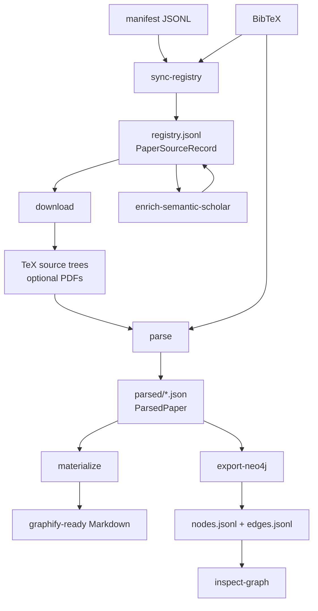
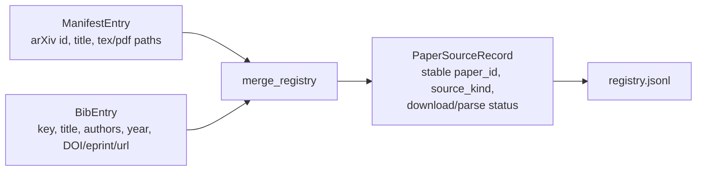
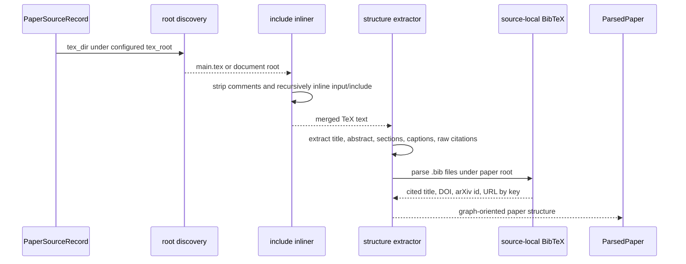
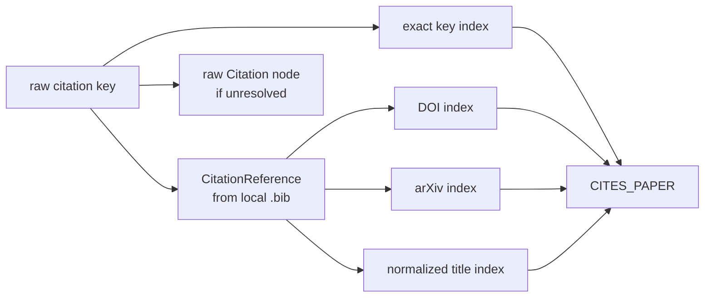
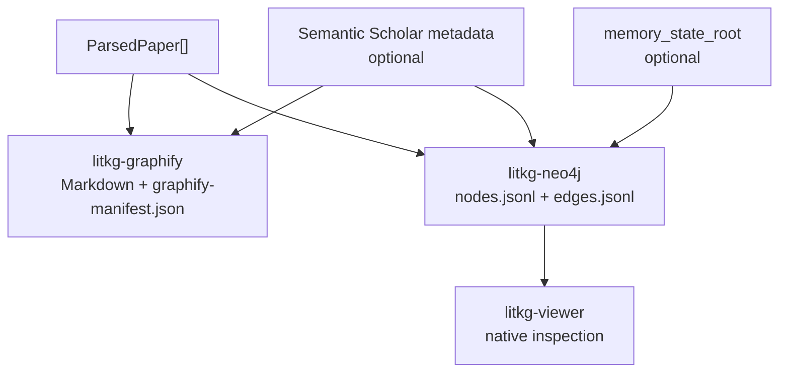

# Architecture

`litkg-rs` is split into a normalized literature core plus thin graph adapters.
For external links, backend status, and exact integration paths, see
[tooling-and-backends.md](tooling-and-backends.md).

## Core Pipeline

1. `sync-registry`
   - read manifest JSONL
   - read BibTeX
   - merge into `PaperSourceRecord`
2. `download`
   - fetch arXiv source bundles and optional PDFs
3. `parse`
   - discover TeX root
   - inline includes
   - extract abstract, sections, captions, and citations
4. `materialize`
   - emit deterministic Markdown corpora for graph ingestion
5. `enrich-semantic-scholar`
   - attach official Semantic Scholar metadata to registry rows by DOI/arXiv/S2 id
6. `rebuild-graph` / `export-neo4j`
   - adapter-specific graph actions
7. `capabilities` / `stats` / `search` / `show-paper`
   - read-only inspection over registry and parsed-paper state

## Registry Merge Contract

- The registry is the durable normalized join between client-owned source
  selection and citation metadata:

- Registry merge is deterministic: merged `PaperSourceRecord` rows are sorted by `paper_id` before writing JSONL.
- BibTeX entries match manifest rows primarily by arXiv id / `eprint` and secondarily by normalized title.
- Manifest-only rows stay in the registry so download and parse state can advance even when a paper does not yet have a citation key.
- Download and parse status live on the normalized record so the pipeline can resume from the registry without adapter-specific sidecar state.

## Download Contract

- Source download targets arXiv `e-print` bundles and optional PDFs derived from the normalized registry.
- Extraction accepts `tar.gz` first and falls back to plain `tar` for arXiv bundles that are not gzip-compressed.
- Archive extraction is path-safe: only normal relative file paths are allowed, and absolute paths, parent traversal, and empty paths are rejected.
- `overwrite = false` preserves existing extracted trees and PDFs; `overwrite = true` refreshes local assets from upstream.

## TeX Parser Contract

- The parser is implemented in `crates/litkg-core/src/tex.rs` and intentionally
  extracts a graph-friendly subset rather than compiling TeX or preserving a
  complete TeX AST.
- Root discovery prefers `main.tex`; otherwise it selects the first `.tex` file that contains both `\documentclass` and `\begin{document}`.
- `\input{...}` and `\include{...}` are inlined recursively relative to the including file, with cycle protection through a visited-file set.
- The parser strips TeX comments before extraction, then emits:
  - abstract text from the `abstract` environment
  - section and subsection structure
  - figure and table captions
  - citation keys from common natbib/biblatex citation commands, including optional-argument forms
  - source-local citation-reference metadata from `.bib` files when available
- Parser output is intentionally lossy for math-heavy regions: TeX command names are removed and the remaining text is whitespace-normalized into readable Markdown-oriented content rather than a full TeX AST.
- When no local TeX tree is available, the paper stays as a metadata-only record instead of failing the whole pipeline.
- Raw citation keys remain available. A separate enrichment pass resolves paper-to-paper citation edges by exact key, DOI, arXiv ID, and normalized title so different source trees can cite the same paper with different local BibTeX keys.

## Citation Enrichment Contract

- `crates/litkg-core/src/enrich.rs` builds a local target index from parsed
  paper metadata, local citation keys, local DOI/arXiv fields, normalized
  titles, and Semantic Scholar external IDs when present.
- For each raw citation key, enrichment first tries an exact citation-key match.
  If the citing paper has source-local `.bib` metadata for that key, it then
  tries DOI, arXiv id, and normalized title.
- Resolved paper-to-paper links are emitted as `CITES_PAPER` edges with
  `strategy`, `score`, and `evidence` properties; unresolved raw keys remain as
  `Citation` nodes/edges in the Neo4j export.
- Topic-neighbor enrichment is deliberately separate from citation resolution:
  it uses weighted token overlap over high-signal parsed text and emits bounded
  `SIMILAR_TOPIC` edges.

## Adapter Boundary

- `litkg-graphify`
  - writes graphify-friendly Markdown corpus, index pages, and a graphify manifest
- `litkg-neo4j`
  - writes an export bundle intended for later Neo4j/MCP ingestion

The core crate does not know anything about a client repo’s specific paths beyond the values supplied through `RepoConfig`.

## Semantic Scholar Contract

- Semantic Scholar integration uses the official REST APIs directly rather than a mandatory MCP server or third-party wrapper.
- API keys are read from `SEMANTIC_SCHOLAR_API_KEY` by default and passed as the `x-api-key` request header.
- The client throttles requests to about one request per second by default, retries HTTP 429 and transient 5xx responses, and honors `Retry-After` when present.
- Registry enrichment uses `/graph/v1/paper/batch` over DOI/arXiv/S2 identifiers and stores the returned compact metadata under `PaperSourceRecord.semantic_scholar`.
- Remote search uses `/graph/v1/paper/search/bulk`; recommendations use `/recommendations/v1/papers`.
- Local BibTeX/manifest metadata remains authoritative for existing registry fields. Semantic Scholar fills missing DOI/arXiv/year/author/url fields and provides graph enrichment metadata.
- Asta MCP is optional future tooling, not the canonical runtime path, because Ai2 documents it as a separate MCP endpoint and key flow.

## Adapter Output Contracts

- Graphify materialization writes one Markdown file per paper plus a deterministic `index.md` and `graphify-manifest.json` under `generated_docs_root`.
- Graphify output is a durable Markdown corpus artifact. It is suitable for
  downstream graph builders, code assistants, and review, but it is regenerated
  from `ParsedPaper` rather than edited by hand.
- Neo4j export writes `nodes.jsonl` and `edges.jsonl` under `neo4j_export_root`, keeping graph export as a file bundle rather than a live database dependency.
- Neo4j export emits Semantic Scholar author, field-of-study, and external-id nodes when registry rows have Semantic Scholar metadata.
- Neo4j export also emits parsed sections, raw citation nodes, resolved
  citation/topic edges, and optional project-memory surfaces from
  `memory_state_root`.
- `sink = both` is additive: the same normalized parsed paper set feeds both adapters without adapter-specific branching in the core model.

## Benchmark And Auto Research Layer

- `litkg-core::benchmark`
  - owns the benchmark catalog schema, benchmark result schema, integration/run-plan schema, validation rules, and autoresearch-target templates
- `litkg-cli`
  - validates benchmark catalogs and result bundles
  - inspects benchmark integration readiness on the local system
  - executes configured benchmark command adapters and normalizes their outputs
  - renders concatenated autoresearch targets from selectable benchmark-aligned components
- `examples/benchmarks/`
  - stores benchmark metadata, integration state, and sample result bundles used by local validation and target rendering

This layer is intentionally repo-independent. It describes evaluation targets, command-adapter contracts, and research-target composition rather than hard-coding one client repo's benchmark harness.

## Inspection Layer

- `litkg-cli` exposes read-only inspection commands over the same normalized registry and parsed-paper artifacts used by the pipeline.
- When `registry.jsonl` is absent, inspection commands derive the normalized registry in memory from manifest and BibTeX inputs rather than writing new generated state.
- `capabilities` reports the repo-specific support surface for one config:
  implemented features, configured paths, generated artifacts, optional runtime
  readiness, benchmark support, and suggested next commands.
- `stats` summarizes coverage and corpus shape from registry rows plus parsed-paper outputs.
- `search` matches against metadata first and parsed content when available, keeping the query path useful even for mixed metadata-only and fully parsed corpora.
- `show-paper` resolves a paper by `paper_id`, citation key, arXiv id, or exact title and reports local paths, extracted structure, outgoing citations, and inbound citation references from the local parsed set.
- The inspection layer is intentionally non-authoritative: it does not mutate registry state or introduce adapter-specific sidecar data.

## Graphify Rebuild Contract

- Materialization must succeed even when graphify is absent.
- The adapter emits graphify-ready docs plus `graphify-manifest.json`.
- Rebuild is an optional post-step invoked through the repo config.
- A missing or failing graphify command should be reported as `skipped`, not treated as a hard pipeline failure.

## Viewer Direction

- The repository backlog should treat Apple Silicon-native Rust graph viewing as a first-class future capability.
- The current preferred direction is a native Rust viewer layer rather than a browser-only graph surface.
- Initial viewer requirements are:
  - local-first and Apple Silicon-friendly
  - compatible with the normalized paper model and optional embedding overlays
  - usable without making Neo4j or a browser the mandatory primary exploration surface
- The initial implemented viewer path now loads the repo-owned Neo4j export bundle (`nodes.jsonl` / `edges.jsonl`) through `litkg-viewer` and is launched by `litkg inspect-graph`.
- Current shortlist:
  - `egui + eframe + petgraph` as the practical default
  - `gpui + wgpu` as the premium macOS-native path
  - `RDFGlance` as a ready-made explorer if an RDF export path is added
  - `Rerun` as an embedding/scene companion rather than the main structural explorer
