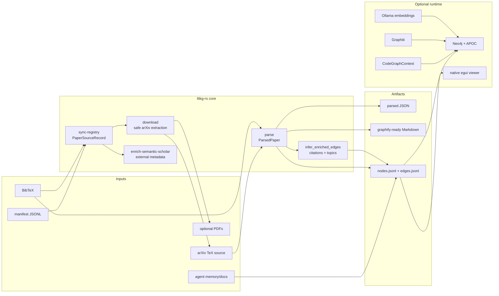
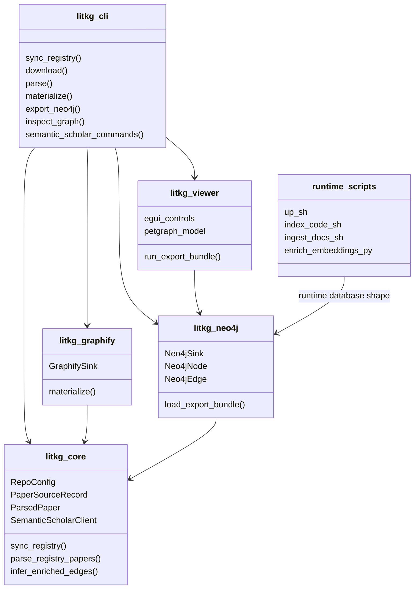
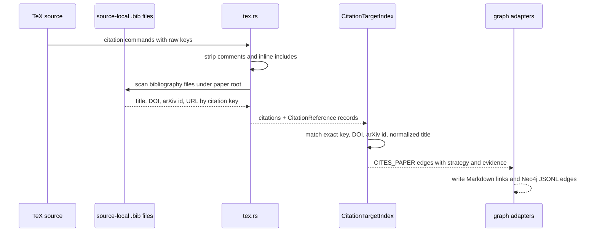
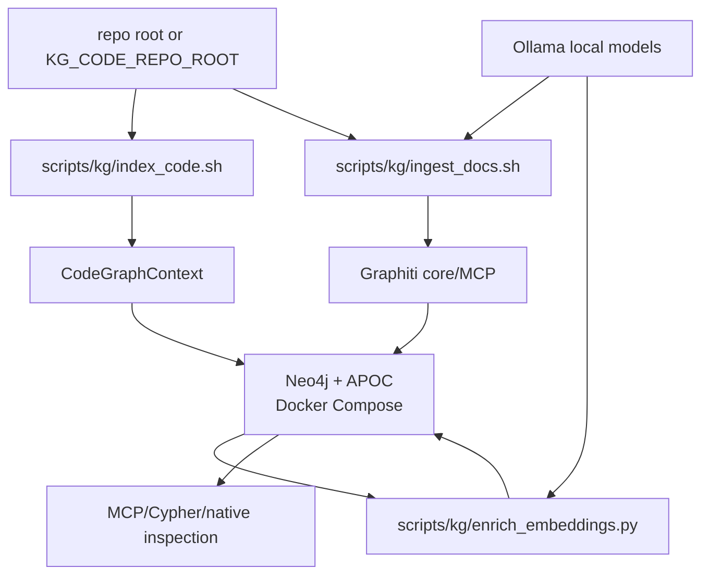

# Tooling And Backends

This page maps the external tools, graph backends, runtime helpers, and parsing
surfaces used by `litkg-rs`. The core pipeline is local-first: source files and
TOML config are the source of truth, while generated Markdown, JSONL, Neo4j
data, Graphiti episodes, embeddings, and viewer state are derived artifacts.

## System Map

## Literature Ingestion

| Tool or format | Status | External link | Where it lives | How litkg-rs uses it |
| --- | --- | --- | --- | --- |
| Manifest JSONL | Required for source downloads | Local repo convention | [`crates/litkg-core/src/manifest.rs`](../crates/litkg-core/src/manifest.rs), [`examples/prml-vslam.toml`](../examples/prml-vslam.toml) | Declares arXiv ids, titles, source directories, and optional PDF targets consumed by `sync-registry` and `download`. |
| TOML config | Required | [`toml`](https://toml.io/) | [`crates/litkg-core/src/config.rs`](../crates/litkg-core/src/config.rs), [`examples/prml-vslam.toml`](../examples/prml-vslam.toml) | Selects manifest/BibTeX/asset/generated roots, sink mode, Semantic Scholar fields, and optional graphify rebuild command. |
| BibTeX | Required for citation metadata | [`BibTeX`](https://ctan.org/pkg/bibtex) | [`crates/litkg-core/src/bibtex.rs`](../crates/litkg-core/src/bibtex.rs), [`crates/litkg-core/src/registry.rs`](../crates/litkg-core/src/registry.rs), [`crates/litkg-core/src/tex.rs`](../crates/litkg-core/src/tex.rs) | Parses bibliography entries, merges them with manifest rows, and normalizes source-local cited references by key, title, DOI, arXiv id, and URL. |
| arXiv | Required for remote source/PDF fetches | [arXiv](https://arxiv.org/), [arXiv API help](https://info.arxiv.org/help/api/index.html) | [`crates/litkg-core/src/download.rs`](../crates/litkg-core/src/download.rs) | Downloads `e-print` source bundles and optional PDFs, then extracts TeX archives with path traversal protection. |
| TeX/LaTeX | Required for source parsing | [LaTeX Project](https://www.latex-project.org/) | [`crates/litkg-core/src/tex.rs`](../crates/litkg-core/src/tex.rs) | Discovers a root `.tex`, strips comments, inlines `\input`/`\include`, extracts title/abstract/sections/captions/citations, and emits lossy Markdown-oriented content. |
| Semantic Scholar REST | Optional enrichment | [Semantic Scholar API](https://www.semanticscholar.org/product/api), [tutorial](https://www.semanticscholar.org/product/api/tutorial) | [`crates/litkg-core/src/semantic_scholar.rs`](../crates/litkg-core/src/semantic_scholar.rs), [`crates/litkg-cli/src/main.rs`](../crates/litkg-cli/src/main.rs) | Uses official Academic Graph and Recommendations endpoints for batch metadata enrichment, search, paper lookup, recommendations, authors, citations, and references. |
| Ai2 Asta MCP | Optional future path | [Asta Scientific Corpus Tool](https://allenai.org/asta/resources/mcp) | [`docs/codex-setup.md`](codex-setup.md) | Documented as non-canonical because it has a separate MCP endpoint and may require a separate Asta tool key. |

## Graph Outputs

| Tool or backend | Status | External link | Where it lives | How litkg-rs uses it |
| --- | --- | --- | --- | --- |
| graphify | Optional file-output consumer | [Graphify](https://graphify.net/hk/) | [`crates/litkg-graphify/src/lib.rs`](../crates/litkg-graphify/src/lib.rs), [`crates/litkg-core/src/materialize.rs`](../crates/litkg-core/src/materialize.rs) | Writes one Markdown file per paper, `index.md`, and `graphify-manifest.json`; a configured `graphify_rebuild_command` may run after materialization, but absence is not fatal. |
| Neo4j export bundle | Optional file-output sink | [Neo4j documentation](https://neo4j.com/docs/) | [`crates/litkg-neo4j/src/lib.rs`](../crates/litkg-neo4j/src/lib.rs) | Emits deterministic `nodes.jsonl` and `edges.jsonl` for papers, sections, citations, Semantic Scholar authors/fields/external ids, enriched edges, and project-memory nodes. |
| Native graph viewer | Implemented Rust-native explorer | [`egui`/`eframe`](https://github.com/emilk/egui), [`petgraph`](https://docs.rs/petgraph/) | [`crates/litkg-viewer/src/lib.rs`](../crates/litkg-viewer/src/lib.rs), [`crates/litkg-cli/src/main.rs`](../crates/litkg-cli/src/main.rs) | `inspect-graph` loads the Neo4j export bundle, builds an in-memory `petgraph`, and renders search, filters, selection, neighbors, pan, and zoom through `eframe`. |
| Rerun | Optional future visualization companion | [Rerun](https://rerun.io/), [`GraphNodes`](https://docs.rs/rerun/latest/rerun/archetypes/struct.GraphNodes.html), [`GraphEdges`](https://docs.rs/rerun/latest/rerun/archetypes/struct.GraphEdges.html) | Not currently implemented | Documented as a Rust-native candidate for graph/embedding/scene companion views, not as the primary structural explorer or graph database. |

## Runtime KG Stack

| Tool or backend | Status | External link | Where it lives | How litkg-rs uses it |
| --- | --- | --- | --- | --- |
| Docker Compose | Optional runtime | [Docker Compose](https://docs.docker.com/compose/) | [`infra/neo4j/docker-compose.yml`](../infra/neo4j/docker-compose.yml), [`scripts/kg/up.sh`](../scripts/kg/up.sh), [`scripts/kg/down.sh`](../scripts/kg/down.sh) | Starts/stops the local Neo4j service and keeps persisted runtime data under ignored `.data/kg` paths. |
| Neo4j + APOC | Optional runtime graph DB | [Neo4j Docker](https://neo4j.com/docs/operations-manual/current/docker/introduction/), [APOC Core](https://neo4j.com/docs/apoc/current/introduction/) | [`infra/neo4j/docker-compose.yml`](../infra/neo4j/docker-compose.yml), [`scripts/kg/enrich_embeddings.py`](../scripts/kg/enrich_embeddings.py) | Stores CodeGraphContext symbols, Graphiti episodes/entities, local embeddings, and `REFERS_TO_CODE` links for interactive runtime queries. |
| CodeGraphContext/code-index | Optional code graph indexing | [CodeGraphContext docs](https://codegraphcontext.github.io/) | [`scripts/kg/index_code.sh`](../scripts/kg/index_code.sh), [`.cgcignore`](../.cgcignore) | Bootstraps a local `uv` virtualenv, indexes a repo or subtree into Neo4j, and supports external repo roots through `KG_CODE_REPO_ROOT`. |
| Graphiti core and MCP | Optional temporal KG/docs ingestion | [Graphiti docs](https://help.getzep.com/graphiti/getting-started/welcome), [Graphiti MCP](https://help.getzep.com/graphiti/getting-started/mcp-server), [GitHub](https://github.com/getzep/graphiti) | [`scripts/kg/start_graphiti.sh`](../scripts/kg/start_graphiti.sh), [`scripts/kg/ingest_docs.sh`](../scripts/kg/ingest_docs.sh), [`docs/codex-setup.md`](codex-setup.md) | Clones/runs upstream Graphiti MCP when requested and uses Graphiti core to ingest repo docs as episodes into the local Neo4j-backed temporal graph. |
| Ollama | Optional local or SSH-tunneled model backend | [Ollama](https://ollama.com/) | [`scripts/kg/ollama_http.py`](../scripts/kg/ollama_http.py), [`scripts/kg/ingest_docs.sh`](../scripts/kg/ingest_docs.sh), [`scripts/kg/enrich_embeddings.py`](../scripts/kg/enrich_embeddings.py), [`scripts/benchmarks/run_repo_qa.py`](../scripts/benchmarks/run_repo_qa.py) | Provides HTTP chat/embedding calls for Graphiti doc ingestion, embedding enrichment, and optional benchmark answering. The KG scripts can read `[runtime.ollama]` from a client litkg TOML config and verify `qwen3-embedding:4b` and `gemma4:26b` over HTTP, so the model server may run on another host via SSH reverse tunnel without a local `ollama` CLI. |
| `uv` | Optional Python runtime bootstrap | [`uv`](https://docs.astral.sh/uv/) | [`scripts/kg/index_code.sh`](../scripts/kg/index_code.sh), [`scripts/kg/ingest_docs.sh`](../scripts/kg/ingest_docs.sh), [`scripts/kg/start_graphiti.sh`](../scripts/kg/start_graphiti.sh) | Creates and reuses isolated virtualenvs for CodeGraphContext and Graphiti helper code. |

## Optional External-Doc Enrichment

| Tool or backend | Status | External link | Where it lives | How litkg-rs uses it |
| --- | --- | --- | --- | --- |
| Context7 | Planned/optional | [Context7 docs](https://context7.com/docs) | No executable adapter yet; documented by downstream KG configs and skills | Intended for resolving library ids and capturing durable provenance links to version-specific library documentation rather than copying large docs into generated outputs by default. |
| MarkItDown | Planned/optional | [Microsoft MarkItDown](https://github.com/microsoft/markitdown) | No executable adapter yet | Intended for optional HTTPS/file-to-Markdown conversion when a client config explicitly enables remote page ingestion. This should remain isolated because remote conversion is slower and less reproducible than local source parsing. |
| Graphity | Planned/optional comparison | [Graphity](https://graphity.tech/) | No executable adapter yet | Tracked only as a possible graph representation/backend comparison point; current implemented graph paths are graphify file output, Neo4j export, Graphiti runtime, and the native viewer. |
| mempalace | Optional client integration | [MemPalace](https://mempalace.github.io/mempalace/), [MCP integration](https://mempalace.github.io/mempalace/guide/mcp-integration.html) | No repo-independent adapter yet | Treat as a client-side memory/KG integration candidate when its API fits cleanly; litkg-rs keeps canonical artifacts file-based. |

## Benchmarks And Automation

| Tool or backend | Status | External link | Where it lives | How litkg-rs uses it |
| --- | --- | --- | --- | --- |
| Benchmark catalogs | Implemented | Local TOML schemas | [`crates/litkg-core/src/benchmark.rs`](../crates/litkg-core/src/benchmark.rs), [`examples/benchmarks/kg.toml`](../examples/benchmarks/kg.toml), [`examples/benchmarks/integrations.toml`](../examples/benchmarks/integrations.toml) | Validates benchmark metadata, integration readiness, run plans, result bundles, and autoresearch target composition. |
| Benchmark command adapters | Implemented | Adapter-specific upstreams listed in [`examples/benchmarks/integrations.toml`](../examples/benchmarks/integrations.toml) | [`crates/litkg-core/src/benchmark_runner.rs`](../crates/litkg-core/src/benchmark_runner.rs), [`scripts/benchmarks/`](../scripts/benchmarks/) | Executes configured local commands and normalizes their output into deterministic result bundles. |
| GitHub CLI | Optional issue sync | [`gh`](https://cli.github.com/) | [`crates/litkg-cli/src/main.rs`](../crates/litkg-cli/src/main.rs) | Previews or creates issue-ready autoresearch targets through `sync-autoresearch-target-issue`. |
| Arrow/Parquet | Implemented tabular export support | [Apache Arrow](https://arrow.apache.org/), [Apache Parquet](https://parquet.apache.org/) | [`crates/litkg-core/src/tabular.rs`](../crates/litkg-core/src/tabular.rs), [`crates/litkg-core/Cargo.toml`](../crates/litkg-core/Cargo.toml) | Provides typed tabular data plumbing for repo-independent artifacts where JSONL is not the right interchange shape. |
| PyO3 | Implemented Python extension surface | [`PyO3`](https://pyo3.rs/) | [`crates/litkg-py/Cargo.toml`](../crates/litkg-py/Cargo.toml), [`python/litkg_rs/__init__.py`](../python/litkg_rs/__init__.py) | Exposes selected Rust-native functionality through a Python extension package without making Python the core implementation language. |

## Crate And Runtime Boundaries

## Citation Unification

## Local Runtime KG

